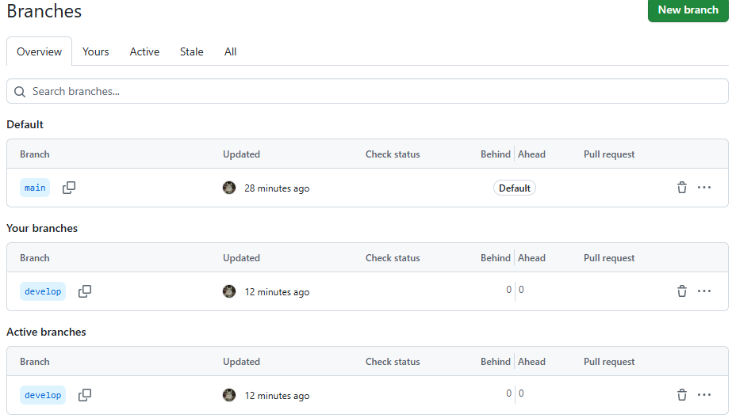
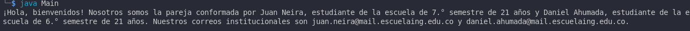
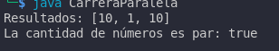
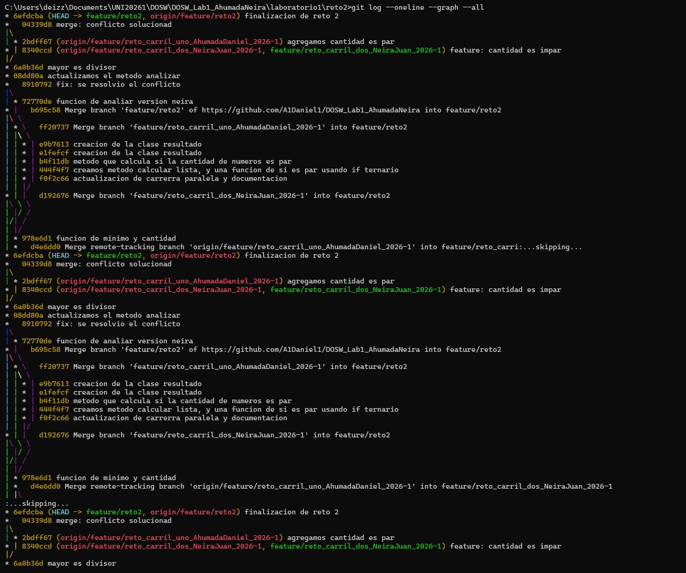
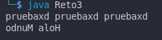
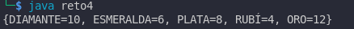
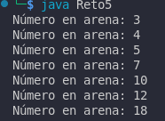
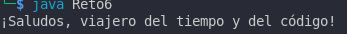

# Maraton Git 2026-1

## Integrantes

- Daniel Alexander Ahumada León
- Juan Manuel Neira Zuluaga

---

## Retos completados

### Reto 0: Configuracion y creacion de rama
**Evidencia:**



**Descripción**
en este ejercicio aplicamos los comandos basicos de git
para traer un repositorio de central a local

---

### Reto 1: La Bienvenida

**Evidencia**



**Descripción**
En este ejercicio lo que hicimos fue aplicar conceptos basicos de
programación funcional y de git para imprimir un mensaje con nuestra
información basica

---

### Reto 2: Carrera en Paralelo

**Evidencia**

resultado:



historial de git:




**Descripción**
Para este reto lo que hicimos fue cada uno desde su branch
ir haciendo los cambios que nos iba pidiendo el ejercicio
En este caso era aplicar funciones lambda a conjuntos de datos

---
### Reto 3: Eco Misterioso

**Evidencia**



**Descripción**
En este caso trabajamos lo que vendria siendo
metodos para las cadenas, trabajamos respectivamente
StringBuilder y StringBuffer. Y reslvimos un conflicto
al mezclar nuestras ramas

---
### Reto 4: El tesoro de las llaves duplicadas

**Evidencia** 



**Descripción**
Para este ejercicio planteamos dos diccionarios para guardar valores
en una rama trabajamos con hashMap en la otra con hashTable. Al final
los juntamos, resolvimos el conflicto e imprimimos el resultado

---

### Reto 5: Batalla de Conjuntos

**Evidencia**



**Descripción**

Para este ejercicio mezclamos distintos tipos de estructuras de datos
Uno uso hashSet para organizar los datos y el otro un treeSet. Al
final unimos todo en una sola estructura ordenada

---


### Reto 6: La máquina de decisiones

**Evidencia**



**Descripción**

Trabajamos un robot que recibe comandos los cuales dentro
de la logica de nuestro codigo con un switch case y usando
lambdas para su ejecución

---

## Preguntas Teoricas

- ¿Cuál es la diferencia entre git merge y git rebase?
git merge une dos ramas creando un commit de merge que conserva el historial completo tal como ocurrio mientras que git rebase reescribe el historial colocando los commits de una rama encima de otra como si se hubieran hecho en linea recta dejando un historial mas limpio

- Si dos ramas modifican la misma línea de un archivo, ¿qué sucede al
hacer merge?

Se crea un conflicto, y el archivo queda con unas marcas especificas

- ¿Cómo puedes ver gráficamente el historial de merges y ramas en
consola?
usando el comando

```
git log --oneline --graph --all
```

esto muestra el historial con ramas y merges de forma visual en la consola

- Explica la diferencia entre un commit y un push.

Un commit es como tomar una captura del codigo en el instante, un push en cambio es mandar esas capturas de un repositorio local a uno centrael

- ¿Para qué sirven git stash y git pop?
  
git stash sirve para guardar temporalmente cambios no confirmados y dejar el working directory limpio sin hacer commit y git stash pop sirve para recuperar esos cambios guardados y aplicarlos nuevamente a la rama actual

- ¿Qué diferencia hay entre HashMap y HashTable?

Un hashMap es mas rapido, permite nulls y hashTable es sincronizada y no permite nulls

- ¿Qué ventajas tiene Collectors.toMap() frente a un bucle tradicional
para llenar un mapa?

permite escribir codigo mas corto y legible se integra con streams facilita un estilo funcional reduce errores comunes y permite definir facilmente claves valores y manejo de claves duplicadas

- Si usas List con objetos y luego aplicas stream().map(), ¿qué tipo de
operación estás haciendo?

estamos aplicando programacion funcional, en donde estamos agarrando cada elemento de la lista y pasandole una funcion lambda dentro del map, para que haga algo con cada elemento

- ¿Qué hace el método stream().filter() y qué retorna?

  filter evalua cada elemento del stream con una condicion y retorna un nuevo stream que solo contiene los elementos que cumplen dicha condicion
  
- Describe el paso a paso de cómo crear una rama desde develop si
es una funcionalidad nueva.

primero verificamos en que rama estamos
```
git branch -a
```

luego lo que hacemos es ir a develop si es que estamos en otra rama

```
git checkout develop
```

despues creamos la rama del feature y nos vamos a ella, lo podemos hacer con
```
git checkout -b featureNuevo
```

- ¿Cuál es la diferencia entre crear una rama con git branch y con git
checkout -b?

git branch solo crea la rama pero no cambia a ella mientras que git checkout -b crea la rama y automaticamente cambia a esa nueva rama en un solo paso

- ¿Por qué es recomendable crear ramas feature/ para nuevas
funcionalidades en lugar de trabajar en main directamente?

Porque digamos que main es ya lo que esta en producción y pues cuando estamos implementando algo nuevo esto puede fallar, entonces la idea es evitar que eso pase. Separando la logica de lo que es el producto ya final del cliente, y lo que trabajamos los desarrolladores
